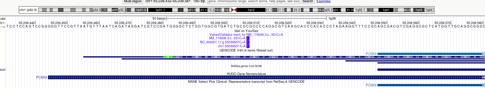

# Transcripts

The **HRMDBQ** prioritizes the **MANE Select** transcript by default. While this is the standard for variant curation, it is important to evaluate if the specific biology of a variant requires an alternative model.

---

## Understanding MANE

[Matched Annotation from NCBI and EMBL-EBI](https://www.ncbi.nlm.nih.gov/refseq/MANE/) (MANE) transcripts represent exact matches between NCBI and Ensembl transcript models.

| Transcript Type | Description |
| :--- | :--- |
| **MANE Select** | A single transcript per locus, representative of the relevant biology. |
| **MANE Plus Clinical** | Additional transcripts for genes where "Pathogenic" (P) or "Likely Pathogenic" (LP) variants cannot be reported via the Select transcript alone. |

---

# Example: *PCSK9*

In [Blesa et al. (2009)](https://pubmed.ncbi.nlm.nih.gov/18559913/), researchers identified a variant affecting gene expression. Depending on the transcript model, the variant's location can be interpreted in multiple ways:

* **Coding sequence**
* **5' UTR sequence**
* **Upstream promoter sequence**

{ width="100%" }
> **Figure 1:** Promoter and 5' Untranslated Region of the F9 gene.

### Variant Specification
The variant is located on **Chromosome 1**: `NC_000001.11:g.55039507C>A`. If we wanted to represent the variant as a 5' UTR sequence we would need to choose the corresponding transcript: `NM_174936.3:c.-331C>A`. However, the authors interpret the major effect as a **promoter variant**.

!!! quote "Evidence Summary"
    Luciferase reporter analysis indicated that the `c.-332C>A` variant caused a **2.5-fold increase** in *PCSK9* promoter activity relative to wild-type. Both patients with the mutation showed higher expression compared to samples with similar LDL-C levels.

**Decision:** We curate this as a **Promoter** variant because the preponderance of evidence suggests its effect is exerted via an alteration of promoter activity.

---

### See also

* [:material-microscope: Morales et al. (2022)](https://pubmed.ncbi.nlm.nih.gov/35388217/) – A joint NCBI and EMBL-EBI transcript set for clinical genomics and research. *Nature*.