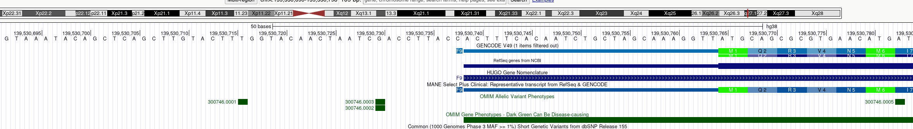
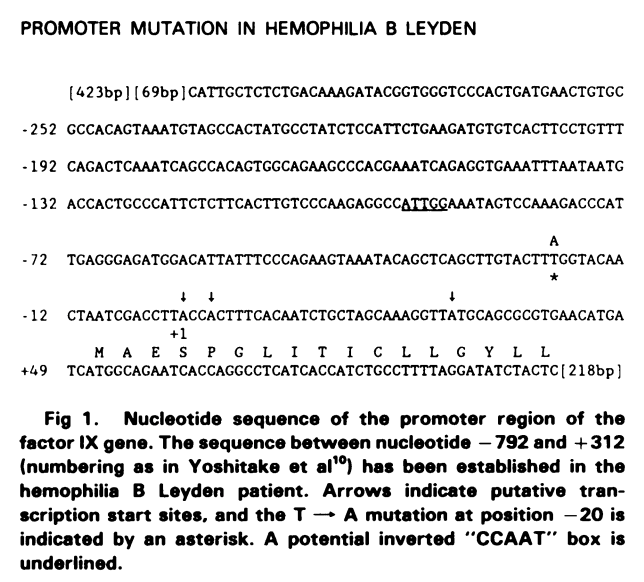

# Promoter variants

todo definition, citations

The green "M1" is the start codon in this view. The thin blue bar of the top cartoon is the 5'UTR. The sequence that is upstream of that is the promoter (note that the promoter can also overlap with the 5'UTR; the 5'UTR is longer in most genes, usually on the order of 50-250 bp).

Older articles often show schematics of the UTR/promoter sequence that allow us to localize variants by comparison to UCSC. For instance, the following is taken from [PMID: 3416069](https://pubmed.ncbi.nlm.nih.gov/3416069/).

In this publication, the variant is indicated with an asterisk (it is a T to A change), and three putative start sites are indicated with arrow. By comparison with UCSC, we can see that the
annotated transcription start site is located between the first two arrows: CACTTTCACA... We can compare the sequences and locate the position of the affected nucleotide (139,530,716). In this case, there is also a link to
an OMIM Allelic Variant ([300756.0001](https://www.omim.org/entry/300746#0001)), and we can follow the link to ClinVar: [RCV](https://www.ncbi.nlm.nih.gov/clinvar/RCV000011304/) from the OMIM page to find the correct variant nomenclature for HRMDBQ: NC_000023.11:g.139530716T>A. Here, we use the accession number for chromosome X for hg38, followed by "g." position REF > ALT.

## Example

The variant described in 
[PMID: 3416069](https://pubmed.ncbi.nlm.nih.gov/3416069/)
should be curated as follows:

- **Gene**: `F9` 
- **Variant**: `NC_000023.11:g.139530716T>A` (using the IG/intergenic option)
- **Variant category**: `Promoter` 
- **Pathomechanism**: We enter `reduced expression` because the concentration of factor IX was found to be reduced in the patient
- **Evidence**: `clinical Protein` because the measurement was made on a clinical sample ("fIX:C levels below 1% of normal"). 
- **Evidence**: `TFBS change prediction`
- **Evidence**: `luciferase` becuase the authors used a CAT assay and showed that " the wild-type promoter of the human fIX gene was capable of directing CAT transcription in HepG2 cells [...]; When the transfections in HepG2 were carried out with the -21T>G mutated construct [...], only a background level of CAT activity was found." (Note that we annotate the CAT assays as luciferase, because they measure the same processes and CAT was essentially precursor to luciferase)
- **Evidence**: 'EMSA' because the authors state "Both the –21 mutation and the –20 mutation disrupt the HNF-4–binding site to a similar level (–16 times more mutant DNA than wild-type DNA was needed to reduce the formation of labeled protein-DNA complex by 50%)." (they are describing a mobility shift assay)
- **Cosegregation**: true, because the authors state
- **Citation**: [PMID:3416069](https://pubmed.ncbi.nlm.nih.gov/3416069/)