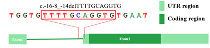
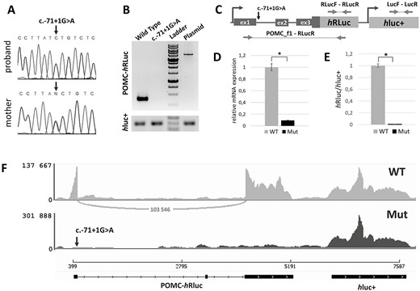

# Splicing variants in non-coding sequences

This project is not concerned with splicing variants in general (there is a vast literature about this!). Instead, the only splicing variants relevant in the current contest are those that are located in non-coding sequences such as untranslated regions (UTRs) and non-coding RNA genes.

## Splicing in UTR sequences

In most genes, the 5' UTR and the 3' UTR are part of the first and last exons, respectively. In some genes, the UTR sequences consist of multiple exons that may show alternative splicing, which presumably is important for gene regulation.

### Example: NM_000166(GJB1):c.‐16‐8_‐14del

The variant NM_000166:c.‐16‐8_‐14del in the GJB1 gene leads to the activation of cryptic splicing sites in exon 2 which results in the deletion of exon 2 ([PMID:36394156](https://pubmed.ncbi.nlm.nih.gov/36394156/)).

We include this variant because it is altering the structure of the 5' UTR.

### Example: NM_000939.4(POMC):c.-21+1G>A

This variant (which was denoted  c.-71+1G>A in the original publication), was shown to alter splicing of the 5' UTR and thereby alter messenger RNA (mRNA) expression ([PMID: 35775692](https://pubmed.ncbi.nlm.nih.gov/35775692/)).

