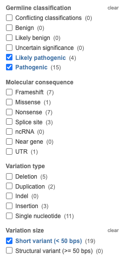
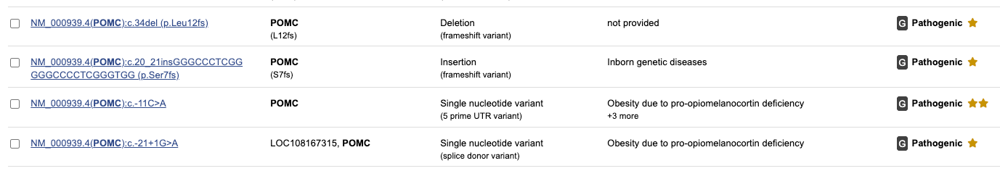

# Finding variants to curate

We would like to curate all of the non-coding variants (NCVs) associated with a gene. The fact that one NCV has been published for a gene may indicate that the gene is in some way susceptible to regulatory perturbation and so it is plausible that other NCVs may exist. This page offers some tips on comprehensively searching for NCVs.

## ClinVar
[ClinVar](https://www.ncbi.nlm.nih.gov/clinvar/) is a freely accessible, public archive of reports of human variations classified for diseases and drug responses.

-   **ClinVar Search**
    * Search for the gene symbol (e.g., *POMC*).
    * Go to the search settings at the left of the gene-specific page
    * Limit to pathogenic/likely pathogenic (P/LP).
    * Limit to Short variants (&lt;50nt).
    * With these settings, search through the variants at the 5' and at the 3' end of the gene.

-   

For instance, the last two variants would be good candidates for curation because they are located in the 5' UTR and are classified as pathogenic.

## PubMed/Google/LLMs

If you have found one pathogenic variant in the 5' UTR of a gene, say *POMC*, then search google with 

!!! info "Search text"
    POMC mutation UTR PMID

Searches like this will often lead to articles in PubMed that contain pathogenic variants in the UTR of the gene in question.

## Cited by

If you have an article that reports the first non-coding variant in a gene, it is good academic practice for any subsequent article to cite the first one. Therefore, examine the "Cited by" list in the main PubMed entry for the first article. Google Scholar has a similar functionality, but in general PubMed should work better for our purposes because we are looking to curate articles that are listed in PubMed.